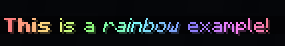

# Syntax


You can escape any format by adding `\` before it!


| Name | Syntax | Alternative |
| :---: | :---: | :---: |
| **Bold** | \*\*Bold\*\* | - |
| _Italic_ | \*Italic\* | \_Italic\_ |
| ~~Strikethrough~~ | ~~Strikethrough~~ | - |
| Underlined | \_\_Underlined\_\_ | - |
| Obfuscated | \|\|Obfuscated\|\| | - |
| Legacy Color | &cColor! | - |
| HexColor | &lt;\#000000&gt;Hex! | &\#000000Hex! |
| Gradient | &lt;g:\#000:\#ffffff&gt;Gradient! | &lt;gradient:\#000:\#ffffff&gt;Gradient! |
| Rainbow | &lt;r:0.5:1.0&gt;Rainbow! | &lt;rainbow:0.5:1.0&gt;Rainbow! |
| Action | \[Text!\]\(hover: Hover Message!\) | - |

### Examples

### Actions

![This is an \[action\]\(hover: &amp;lt;r&amp;gt;Hover message!\) example!](../../.gitbook/assets/image%20%288%29.png)

The syntax for actions are simple, the text that'll be displayed goes in the `[ ]` and the action itself goes in `( )` the currently supported actions are:

* **Hover** - Displays a hover message, `[**Message**](hover: <r>Hover message here!)` both supports the markdown syntax as well.
* **Command** - Runs a command when clicked `[**Message**](command: /home)` if no `/` is present, it'll just say the message in chat instead, when clicking.
* **Suggest** - Suggests a command when clicked`[**Message**](suggest: /home)`
* Clipboard - Copies the text to clipboard when clicked`[**Message**](clipboard: This will be copied)`
* **Url** -  Opens a URL link when clicked`[**Message**](url: https://mf.mattstudios.me/)`


To have an action with both hover and a click event use the separator `|`, which can also be escaped like `\|`.



**Limitations**

Currently due to some limitations the markdown syntax won't pass through actions, for example: `**Message [action](hove: Test) more message**` will result in displaying the full message: `**Message action more message**` without parsing.

Colors will pass through correctly though.


