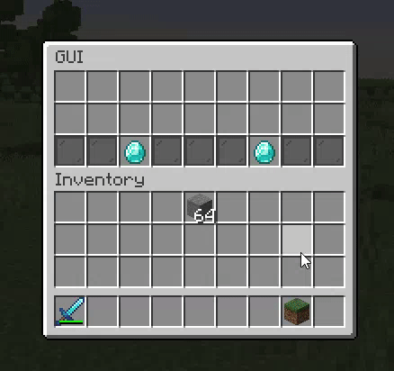

# Persistent GUI



### Creating a Persistent GUI

To create a persistent GUI all you need to do is:

```java
// Main constructor
PersistentGui persistentGui = new PersistentGui(3, "GUI Title");

// Alternative
PersistentGui persistentGui = new PersistentGui("GUI Title");
```

Just like the normal [GUI](gui.md) the first parameter is the rows the GUI should have.

### Adding the item to the GUI

Differently to the normal [GUI](gui.md), the `addItem` method takes an `ItemStack` instead. Any `GuiItem` added will have actions applied to it, the persistent items are simple ItemStacks that have nothing associated to it.

