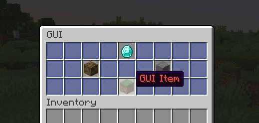

# GUI



### Creating a GUI

To create a GUI all you need to do is:

```java
// Main way to create a GUI
Gui gui = Gui.gui()
        .title(Component.text("GUI Title!"))
        .rows(6)
        .create();

// Typed GUI
Gui gui = Gui.gui()
        .title(Component.text("GUI Title!"))
        .type(GuiType.DISPENSER)
        .create();
```

If rows are used instead of the type, it'll use `GuiType.CHEST`.

**Current supported GUI types:**

* CHEST - Default - 0 to 53 slots
* WORKBENCH - 0 to 9 slots
* DISPENSER - 0 to 8 slots
* BREWING - 0 to 4 slots

### Creating a GUI item

Each item added to the GUI need to be a `GuiItem`.

```java
// Alternatively you can use the ItemBuilder
GuiItem guiItem = ItemBuilder.from(Material.STONE).asGuiItem();
GuiItem guiItem = ItemBuilder.from(Material.STONE).asGuiItem(event -> {
    // Handle your click action here
});
```

Each GUI item needs an item stack, you may want to add a click action or not.  
The action for an item is simply the `InventoryClickEvent` so handle it like you would be doing your own listener.

### Adding the item to the GUI

Now that we have our `GuiItem`, we can easily add it to the GUI.

```java
// Using a slot number from 0 to 53
gui.setItem(slot, guiItem);

// Using rows and columns
gui.setItem(row, col, guiItem);

// Using add item to add to next free slot
gui.addItem(guiItem);
```

You have the option to set it the way you want, for example the slot `0` is the `row 1, col 1`. Attention as if you specify a slot that exceeds the GUI limit it'll throw a `GuiException`.

### Opening the GUI

To open the GUI to the player you just need to call the method `open`.

```java
gui.open(player);
```

