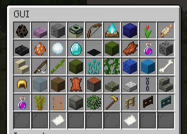

# Paginated GUI



### Creating a Paginated GUI

To create a Paginated GUI all you need to do is:

```java
// Main constructor
PaginatedGui gui = Gui.paginated()
        .title(Component.text("GUI Title!"))
        .rows(6)
        .pageSize(45) // Set the size you want, or leave it to be automatic.
        .create();
```

The page size, is how big the page should be, in the example above it's 45 slots dedicated for the page, if nothing is set the lib will calculate the page size when opening.

### Creating the navigation

To create the navigation items we can simply do:

```java
// Previous item
paginatedGui.setItem(6, 3, ItemBuilder.from(Material.PAPER).setName("Previous").asGuiItem(event -> paginatedGui.previous()));
// Next item
paginatedGui.setItem(6, 7, ItemBuilder.from(Material.PAPER).setName("Next").asGuiItem(event -> paginatedGui.next()));
```

Recommended to add a default click action to cancel the click even when working with pagination, if not, then make sure the navigation item cancels the click before doing `PaginatedGui#next/previous` .

### Populating the page

To add items to the page once again we use the `PaginatedGui#addItem` which takes a `GuiItem`. Items added with `PaginatedGui#setItem` will not be counted towards the page but as static GUI items.

